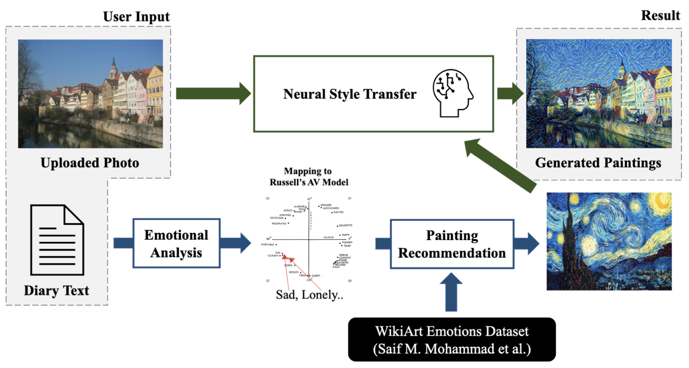

# GamSeong-HwaBaek: Emotion-based Neural Paintings' Style Transfer
Main repository for 감성화백(GamSeong-HwaBaek) project.

### Our Team 
 - **Nahyuk Lee**([@NahyukLEE](https://github.com/NahyukLEE)) (School of Computer Science & Engineering :desktop_computer:, Chung-Ang Univ.)
    - Computer Vision & NLP Developer
 - **Haeun Lee**([@Haeun0415](https://github.com/Haeun0415)) (School of Computer Science & Engineering :desktop_computer:, Chung-Ang Univ.)
    - Back-end(main) / Front-end(sub) Developer
 - **Eunseo Choi**([@es3442](https://github.com/es3442)) (School of Computer Science & Engineering :desktop_computer:, Chung-Ang Univ.)
    - Front-end(main) / Back-end(sub) Developer

## Pipeline



## Test Environment
- MacOS Monterey
- Python 3.8.12


## Prepare Data
#### Install dependencies
```
pip install -r requirements.txt
```

#### Download WikiArt-Emotion & WikiArt Dataset
Painting images will be downloaded in `data/image`, it will takes long time.
```
python download_dataset.py
```
